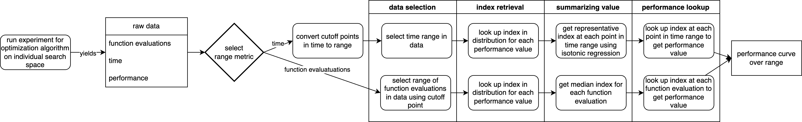
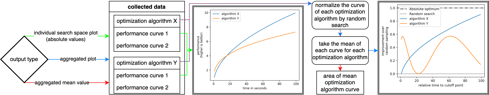

Getting Started
---------------

Start out by installing the package. 
The simplest way to do this is ``pip install autotuning_methodology``. 
Python 3.9 and up are supported. 

Defining an experiment
^^^^^^^^^^^^^^^^^^^^^^
To get started, all you need is an experiments file. 
This is a `json` file that describes the details of your comparison: which algorithms to use, which programs to tune on which devices, the graphs to output and so on. 
A simple example experiments file is as follows:

.. literalinclude:: ../experiment_files/simple_example.json
    :language: JSON

Running experiments
^^^^^^^^^^^^^^^^^^^
To use these experiment files, two entry points are defined: ``autotuning_experiment`` and ``autotuning_visualize``. 
Both entrypoints take one argument: the path to the experiments file. 
The first runs the experiment and saves the results, the second visualizes the results. 
``autotuning_experiment`` is intended for situations where you do not evaluate on the same machine as you visualize on (e.g. running on a cluster and visualizing on your laptop). 
If the results do not yet exists, ``autotuning_visualize`` will automatically trigger ``autotuning_experiment``, so when running on the same machine, ``autotuning_visualize`` is all you need. 

A note on file references
^^^^^^^^^^^^^^^^^^^^^^^^^
File references in experiments files are relative to the location of the experiment file itself. 
File references in tuning scripts are relative to the location of the tuning script itself. Tuning scripts need to have the global literals `file_path_results` and `file_path_metadata` for this package to know where to get the results. 
Plots outputted by this package are placed in a folder called `generated_plots` relative to the current working directory. 

Processing Pipeline
^^^^^^^^^^^^^^^^^^^
To clarify the complex process of this package to obtain the results and visualize, the flowcharts below illustrate this pipeline.

The first flowchart shows the tranformation of raw, stochastic optimization algorithm data to a performance curve. 

The second flowchart shows the adaption of performance curves of various optimization algorithms and search spaces to the desired output.
