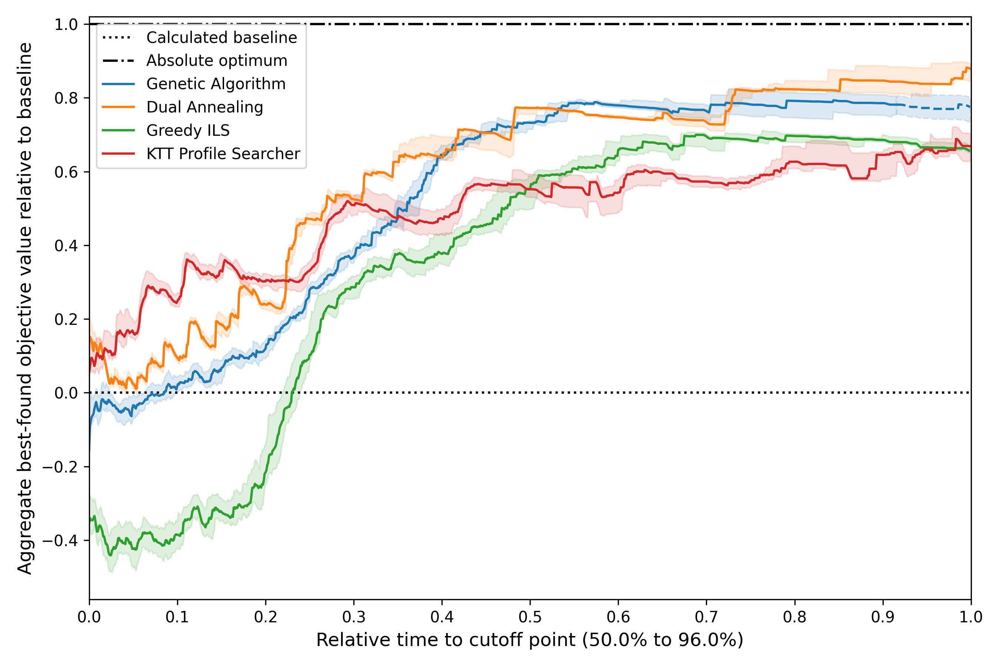

Autotuning Methodology documentation
==================================================

Welcome to the documentation for the ``autotuning_methodology`` package accompanying the paper "A Methodology for Comparing Auto-Tuning Optimization Algorithms". 
This package makes the guidelines in the paper easy to apply: specificy the experiments ``json`` file, run ``autotuning_visualize [path_to_json]`` and wait for the results!

This is an example output of this methodology package. It depicts the aggregated performance of four optimization algorithms for two kernels on two GPUs. 

.. Getting started
.. ---------------
.. ..  include:: getting_started.rst

.. .. automodule:: src.autotuning_methodology.experiments
..     :members:

.. .. automodule:: src.autotuning_methodology.visualize_experiments
..     :members:

.. toctree::
   :caption: Documentation Contents
   :maxdepth: 1

   getting_started
   contributing
   autotuning_methodology

.. Indices and tables
.. ==================

.. * :ref:`genindex`
.. * :ref:`modindex`
.. * :ref:`search`
